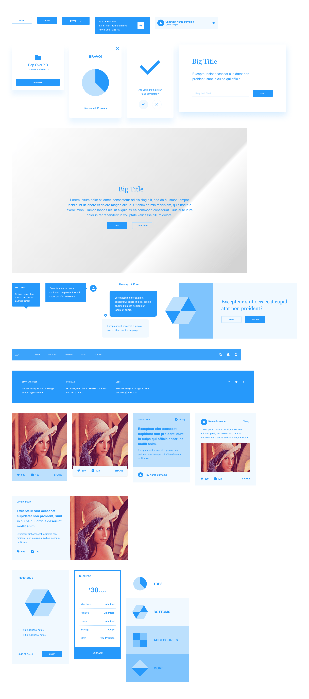
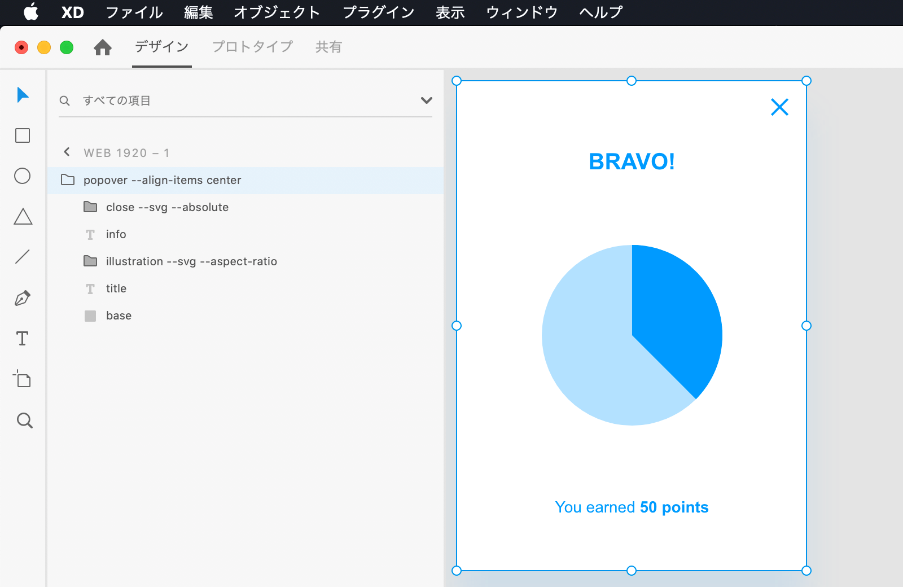
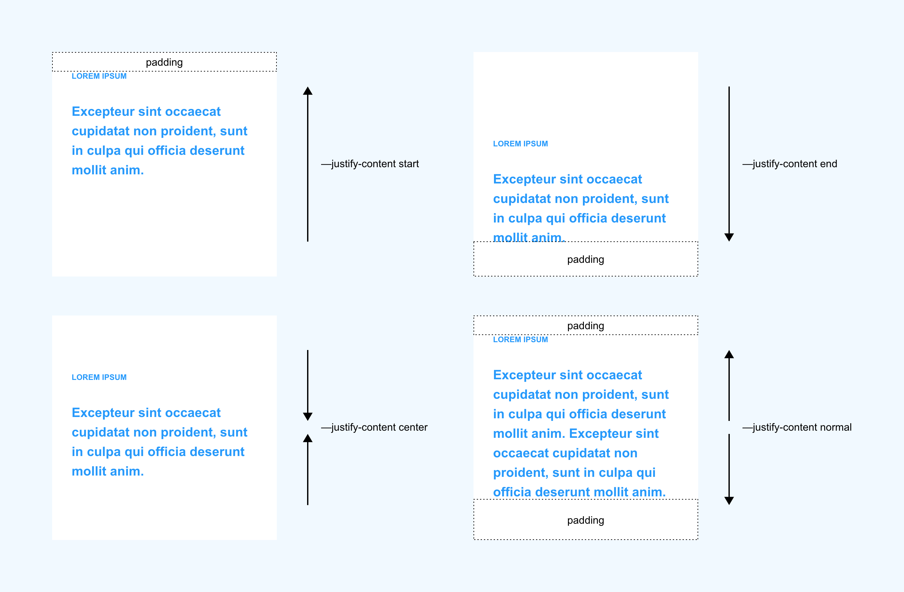
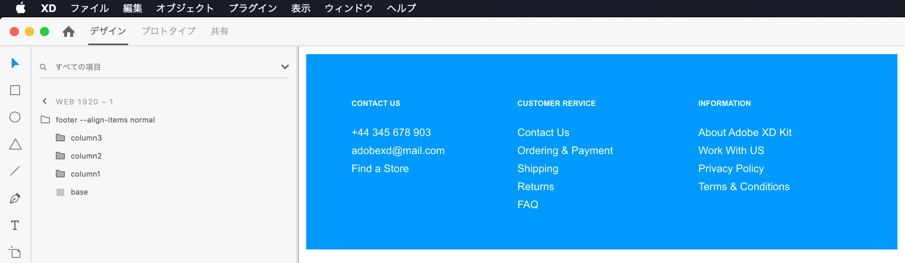
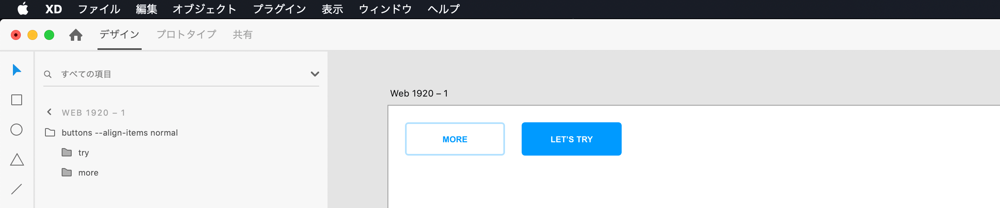

# xd-copy-html-css

選択したオブジェクトの HTML/CSS を取得し、クリップボードにコピーする Adobe XD プラグインです。

次のようなコンポーネントのエクスポートが可能で、リサイズにもある程度対応したコードが生成されます。

## インストール

[リリースページ](https://github.com/ichitaro/xd-copy-html-css/releases) から最新版の .xdx ファイルをダウンロードし、ダブルクリックしてインストールしてください。

## 使い方

XD 上でオブジェクト 1 つ選択し、メニューから `プラグイン > Copy HTML/CSS` を実行してください。

下記のショートカットも利用可能です。

- `Cmd+Shift+H` (Mac)
- `Ctrl+Shift+H` (Win)

## サンプル

サンプルの XD ファイルで動作確認が可能です。

1. [examples/wires.xd](https://github.com/ichitaro/xd-copy-html-css/raw/master/examples/wires.xd) をダウンロードします。
2. アートボード直下のレイヤーを何か一つ選択し、プラグインを実行します。
3. 生成されたコードを [CodePen](https://codepen.io/pen/) に貼り付けると、結果を素早く確認できます。

## オプション

レイヤー名にオプションを記述することで、HTML/CSS への変換方法をカスタマイズできます。

レイヤー名の記法はシェルのコマンドライン引数と同じです。

上の例の `close --svg --absolute` というレイヤー名は、次のような意味になります。

- `close` はクラス名のプレフィックスになります。
- `--svg` と `--absolute` という 2 つのフラグを指定しています。

最初の引数はクラス名のプレフィックスに使われ、残りの引数は全てオプションになります。

オプションの中には値を取るものもあります。XD のオブジェクトタイプ応じて利用できるオプションは異なります。

引数を完全に省略してもデフォルト値で変換が行われます。無理に全てのレイヤーをリネームする必要はありません。
- XD のデフォルトのレイヤー名は引数なしとみなされます。
- 最初の引数がクラス名として無効な文字列の場合、デフォルトの名前が付けられます。

## 変換ルール

XD のオブジェクトタイプ別に適切なコードへと変換します。

- `--svg` フラグが指定されているレイヤー／回転しているレイヤー:
  - SVG に変換されます。
- 長方形／罫線:
  - 対応するコードに変換されます。
- それ以外のシェイプ／パス／ブーリアングループ:
  - SVG に変換されます。
- テキスト:
  - 対応するコードに変換されます。
- グループ:
  - 単一行の (折り返しのない) フレックスコンテナへと変換されます。
  - グループの子レイヤーは、基本的には水平方向か垂直方向に並べる必要があります。

以下の XD オブジェクトは API 上の制限があるため直接サポートしていません。

- コンポーネント
- リピートグリッド
- リンクされたグラフィック

これらのオブジェクトをエクスポートするには、予めグループ化を解除する必要があります。グループ化を解除しない場合、SVG に変換されます。

## 長方形

以下のプロパティがエクスポートされます。

- 単色の塗り
- 線形グラデーション
  - 円形グラデーションはサポートしていません。
- 画像
  - 画像自体はエクスポートされず、ダミー画像の URL が挿入されます。
- 境界線
  - 中央の境界線はサポートしていません。
  - 破線はサポートしていません。
  - 外側の境界線は CSS の `outline` プロパティに変換されますが、角丸が効きません。
    - 基本は内側の境界線を使うことをお勧めします。
- 角丸
- シャドウ
- 不透明度

### オプション

| オプション | 別名 | 値 | 説明 |
| ---- | ---- | ---- | ---- |
| `--aspect-ratio` | `--ratio` `-r` | なし | アスペクト比を固定する CSS が生成される。 比率は XD 上のサイズに準じる。 |
| `--inline` | `-i` | なし | 画像はデフォルトで `background-image` に変換されるが、 このフラグを指定すると `` 要素に変換される。 |

## 罫線

罫線 (水平線・垂直線) は専用の HTML/CSS に変換されます。

実線と破線のエクスポートが可能です。 (破線も CSS の `linear-gradient` で XD に忠実に再現されます)

この変換を適応するためには、次のようなオブジェクトを作成する必要があります。
- オブジェクトタイプは線、またはパス (2つの頂点を持つ線分) 
- 線分は完全に水平、または垂直

## SVG

以下の オブジェクトは SVG としてエクスポートされます。

- シェイプ (長方形と罫線以外)
- パス
- ブーリアングループ
- `--svg` フラグが指定されたレイヤー
- 回転しているレイヤー
  - SVG 化されるレイヤーやその子孫は回転していても問題ありませんが、祖先に回転があると正しく変換されません。

SVG コードは [SVGO](https://github.com/svg/svgo) で最適化されます。

### オプション

| オプション | 別名 | 値 | 説明 |
| ---- | ---- | ---- | ---- |
| `--svg` | `-s` | なし &#124; `break` | レイヤーを SVG としてエクスポートする。 値に `break` を指定するとレイヤー内のテキストがパスに変換される。  |
| `--aspect-ratio` | `--ratio` `-r` | なし | アスペクト比を固定する CSS が生成される。 比率は XD 上のサイズに準じる。 |
| `--inline` | `-i` | なし | SVG はデフォルトで `background-image` に変換されるが、 このフラグを指定すると `<svg>` 要素に変換される。  |

## テキスト

以下のプロパティがエクスポートされます。

- フォント
- フォントサイズ
- フォントスタイル (ウェイト)
  - フォント名から推測するため、正しくエクスポートされない場合があります。
- 文字の間隔
- 行送り
  - 必ず値を設定してください。デフォルトの行送りのままだと、API が 0 を返すためです。
- 段落スペース
- テキストアライン
- ポイントテキスト or エリア内テキスト
- テキストトランフォーム
- 上付き文字 or 下付き文字
- 下線
- 打ち消し線
- 塗り (色)
- 不透明度
- シャドウ

### 範囲スタイル

テキストの部分的なスタイルもサポートしています。範囲は `` 要素でラップされます。

### 段落

段落もサポートしています。オブジェクトの段落スペースの有無により、マークアップが変化します。

- 段落スペースが 0 の場合:
  - 改行を ` ` に変換し、段落は生成されません。
- 段落スペースが 0 より大きい場合:
  - 改行を段落の区切りとみなし、`
` 要素でラップします。` ` は生成されません。
  - XD では 1 つの改行が段落の区切りを表しますので、その仕様に準じています。

### ポイントテキスト vs エリア内テキスト

テキストを単体でエクスポートする分には両者に大きな違いはありません。

テキストをグループの子レイヤーとして配置する場合、コンテナのサイズ指定に影響し、生成される CSS が変化します。
- ポイントテキストの場合、コンテンツに基づく幅が尊重され、 `width` は指定されません。
  - テキスト量に応じてコンテナの幅を可変させたいケースなどで使用します。
- エリア内テキストの場合、コンテンツに基づく幅はありませんので、基本的に `width` が指定されます。

## グループ

グループは単一行の (折り返しのない) フレックスコンテナへと変換されます。

グループの子レイヤーは縦並び or 横並びになっている必要があります。 CSS グリッド や `flex-wrap` を使った 2 次元的なレイアウトはサポートしていませんが、フレックスコンテナをネストすることで、複雑なレイアウトにも対応できます。

### 主軸の方向

子レイヤーの配置から自動的に主軸の方向が判別されます。

子レイヤーは主軸に沿って重ならないように並べる必要があります。縦方向にも横方向にも重なりがある場合、フレックスコンテナには変換されず、全ての子レイヤーが絶対位置指定要素として扱われます。

オプションで主軸を明示することが可能で、その場合は重なりがあっても問題ありません。 (ネガティブマージンになります)

| 例 | 説明 |
| ---- | ---- |
| `--type v-stack` | `flex-direction: column;` に変換 |
| `--type h-stack` | `flex-direction: row;` に変換 |
| `--type absolute` | 全ての子レイヤーを絶対位置指定要素として扱う |

### ベースの長方形の抽出

グループのベースの長方形 (座布団) は自動的に抽出されます。

通常、人が手書きでコーディングする際は、座布団は独立した子要素ではなく、なるべく親要素のボーダーや背景スタイルにまとめてしまうことが多いかと思いますが、同様の最適化が行われます。

この最適化を適応するには、次のようなオブジェクトを作成する必要があります。
- オブジェクトタイプは長方形で、全てのコンテンツを内包できる大きさと位置を持つ
- グループの最初 (最背面) の子レイヤーになっている
  
条件を満たしたオブジェクトは親要素のスタイルへと変換され、フローから外れますので、重なっていても問題ありません。

「座布団は敷きたくないが、コンテナの境界をコンテンツよりも広く確保したい」という場合は、塗りのない長方形をグループの最背面に設置してください。

### 絶対位置指定

グループの子レイヤーに `--absolute` オプションを指定すると、そのレイヤーは絶対位置指定要素に変換されます。

`--absolute` が指定されたレイヤーはフローから外れますので、重なっていても問題ありません。

値にキーワードを指定することで、整列を変更できます。省略した場合はオブジェクトの配置から自動的に判別されます。

| 例 | 説明 |
| ---- | ---- |
| `--absolute` | 自動判別 |
| `--absolute center` | 上下左右: 中央揃え |
| `--absolute "start end"` | 垂直: 上揃え　水平: 右揃え |
| `--absolute "stretch auto"` | 垂直: コンテナの高さに伸縮　水平: 自動判別 |

キーワードを2つ指定するときは CSS と同様に `"垂直 水平"` の順になります。 (クォートが必要です)

設定できるキーワードとその意味は次の通りです。

| キーワード | 別名 | 説明 |
| ---- | ---- | ---- |
| `start` | `s` | 上揃え (左揃え) |
| `center` | `c` | 中央揃え |
| `end` | `e` | 下揃え (右揃え) |
| `stretch` | `fill` `f` | コンテナに合わせて伸縮 |
| `auto` | | 自動判別 |

整列を指定しても HTML 上の外観に目に見える変化はなく、 XD 上の外観と一致したままです。コンテナをリサイズするとはじめて、整列による違いが表れてきます。

絶対位置指定要素はベースの長方形の外側に配置することも可能です。 ( `--absolute` 指定されたレイヤーを除外した上で、コンテナの境界ボックスが決定されます)

下記のようなユースケースを想定しています。

- 閉じるボタンだけをコンテナの外側に設置する
- 吹き出しの三角形パーツだけをコンテナの外側に設置する

### パディングの自動抽出

コンテンツに共通している余白は、自動的に親要素のパディングとして抽出されます。 

グループにオプションを指定することで、任意のパディングに変更することが可能です。

| 例 | 説明 |
| ---- | ---- |
| `--padding 10` | 上下左右: 10px |
| `-p0` | 上下左右: 0px |
| `--padding "auto 30"` | 上下:自動　左右:30px |
| `--padding "10 auto 30"` | 上: 10px　左右: 自動　下: 30px |
| `--padding "10 20 30 40"` | 上: 10px　右: 20px　下: 30px　左: 40px |

値を並べる順番は CSS と同様です。

パディングを変更しても XD と外観が異なってしまうことはありません。子要素のマージンで相殺されます。

### 主軸方向の整列

整列は XD 上のオブジェクトの配置から自動的に判別されます。

コンテンツがグループの端に近いと、その端に寄せているとみなされます。コンテンツのサイズの割合が50%以上だと整列ではなく、通常の配置とみなされます。なお、 XD のレスポンシブサイズの設定は一切影響しません (API上の制限があり連動していません)。

グループにオプションを指定することで、任意の整列に変更可能です。

| オプション | 別名 |　値 |
| ---- | ---- | ---- |
| `--justify-content` | `--jc` | 1つのキーワード |

設定できるキーワードは次のいずれかです。

| キーワード | 別名 | 説明 |
| ---- | ---- | ---- |
| `normal` | `n` | 整列は行わず、主軸の開始側に詰めて配置 |
| `start` | `s` | 主軸の開始側に寄せる |
| `center` | `c` | 主軸の中央に寄せる |
| `end` | `e` | 主軸の終端側に寄せる |
| `both` | `b` | 最大の余白を境にして、コンテンツを主軸の両端に寄せる |
| `auto` | | 自動判別 |

整列の値により、次の項目も暗黙的に決定されることに注意してください。

- コンテナの主軸方向のサイズ
  - 固定 or コンテンツに基づいて可変
- コンテンツの主軸の両端にある余白の解釈
  - コンテンツに共通する余白を、親要素のパディングとして抽出すべきか？

| キーワード | コンテナの主軸方向のサイズ |　主軸の開始側の余白 |　主軸の終了側の余白 |
| ---- | ---- | ---- | ---- |
| `normal` | 可変 (コンテンツに基づく) | 抽出候補 | 抽出候補 |
| `both` | 固定 | 抽出候補 | 抽出候補 |
| `start` | 固定 | 抽出候補 | なし |
| `end` | 固定 | なし | 抽出候補 |
| `center` | 固定 | なし | なし |

具体例を挙げると以下のようになります。

| 例 | 説明 |
| ---- | ---- |
| `--type h-stack --justify-content center`  | コンテナの幅: 固定 コンテンツの整列: 左右中央揃え コンテンツの左右の余白: なし |
| `--type h-stack --justify-content normal` | コンテナの幅: コンテンツの幅に基づく コンテンツの整列: なし コンテンツの左右の余白: 親要素のパディングとして抽出 |

### 対称軸方向の整列

子レイヤーの対称軸方向の整列も、主軸と同様に自動的に判別されますが、オプションで変更可能です。

グループにオプションを指定することで、子レイヤーの対称軸方向の整列を一括指定することができます。

| オプション | 別名 |　値 |
| ---- | ---- | ---- |
| `--align-items` | `--ai` | 1つのキーワード |

子レイヤーにオプションを指定することで、対称軸方向の整列を個別に指定することも可能です。

| オプション | 別名 |　値 |
| ---- | ---- | ---- |
| `--align-self` | `--as` | 1つのキーワード |

設定できるキーワードは次のいずれかです。

| キーワード | 別名 |　説明 |
| ---- | ---- | ---- |
| `normal` | `n` | 対称軸の開始側に寄せる |
| `stretch` | `fill` `f` | コンテナに合わせて伸縮 |
| `start` | `s` | 対称軸の開始側に寄せる |
| `center` | `c` | 対称軸の中央に寄せる |
| `end` | `e` | 対称軸の終端側に寄せる |
| `auto` | | 自動判別 |

整列の値により、次の項目が暗黙的に決定されることに注意してください。

#### コンテナの対称軸方向のサイズ

コンテナの対称軸方向のサイズは、対称軸で最長のアイテムの整列で決まります。

| 最長アイテムの整列 | コンテナの対称軸方向のサイズ |
| ---- | ---- |
| `normal` | 可変 (コンテンツに基づく) |
| `stretch` | 固定 |
| `start` | 固定 |
| `end` | 固定 |
| `center` | 固定 |

#### コンテンツの対称軸の両端にある余白の解釈

整列で寄せている端の余白は、親要素のパディングとして抽出される候補になります。

| キーワード |　対称軸の開始側の余白 |　対称軸の終了側の余白 |
| ---- | ---- | ---- |
| `normal` | 抽出候補 | 抽出候補 |
| `stretch` | 抽出候補 | 抽出候補 |
| `start` |  抽出候補 | なし |
| `end` | なし | 抽出候補 |
| `center` | なし | なし |

### normal の使い道

コンテナよりもコンテンツのサイズを優先したい場合、 `normal` を使用してください。

上の例のように、高さが異なるアイテムを横並び・上揃えで並べつつ、コンテナの高さをコンテンツに基づいて決めたい場合、 `--align-items normal` を指定します。

`normal` は `start` と同じく開始側に揃えますが、コンテンツの終端側の余白もパディング抽出の候補になり、コンテナサイズも可変になるという違いがあります。この例の場合、テキストの行数に連動してフッターの高さが変わり、適切なパディングが維持されます。

同じ高さのボタンを横並びで並べる場合も、 `--align-items normal` の方が適切です。

この例でオプションを省略した場合、自動判別の結果、 `buttons` は `--align-items stretch` と解釈され、本来ボタンの方に設定すべき高さが、コンテナの方に設定されてしまいます。 (個々のボタンは固有の高さを持たず、コンテナの高さに合わせて伸縮するようになってしまいます)

### オプション

#### グループ

| オプション | 別名 | 値 | 説明 |
| ---- | ---- | ---- | ---- |
| `--type` | `-t` | `v-stack` &#124; `h-stack` &#124; `absolute` 別名: `v` &#124; `h` &#124; `a` | グループの子レイヤーの並べ方 |
| `--padding` | `-p` | 1〜4つの値 値は数値か `auto` | 共通パディングを上書きする |
| `--justify-content` | `--jc` | `normal` &#124; `start` &#124; `center` &#124; `end` &#124; `both` 別名: `n` &#124; `s` &#124; `c` &#124; `e` &#124; `b` | 主軸方向の整列 |
| `--align-items` | `--ai` | `normal` &#124; `stretch` (= `fill`) &#124; `start` &#124; `center` &#124; `end` 別名: `n` &#124; `f` &#124; `s` &#124; `c` &#124; `e` | 子レイヤーの対称軸方向の整列 (一括) |
| `--aspect-ratio` | `--ratio` `-r` | なし | アスペクト比を固定する CSS が生成される。 比率は XD 上のサイズに準じる。 |

#### 子レイヤー
| オプション | 別名 | 値 | 説明 |
| ---- | ---- | ---- | ---- |
| `--align-self` | `--as` | `normal` &#124; `stretch` (= `fill`) &#124; `start` &#124; `center` &#124; `end` 別名: `n` &#124; `f` &#124; `s` &#124; `c` &#124; `e` | 子レイヤーの対称軸方向の整列 |
| `--absolute` | `-a` | 0〜2つのキーワード: `stretch` (= `fill`) &#124; `start` &#124; `center` &#124; `end` &#124; `auto` 別名: `f` &#124; `s` &#124; `c` &#124; `e` | 子レイヤーを絶対位置指定要素にする |
| `--relative-length` | `--rl` | なし &#124; `fr` | 主軸方向のサイズを%指定にする。 割合は XD 上のサイズに準じる。 コンテナの主軸方向のサイズは固定、 パディングは強制的に 0 になる。 値に `fr` を指定すると flex 係数になる。 |
| `--relative-width` | `--rw` | なし | 対称軸方向のサイズを%指定にする。 割合は XD 上のサイズに準じる。 コンテナの対称軸方向のサイズは固定、 パディングは強制的に 0 になる。 |
| `--break-word` | `--bw` | なし | テキスト限定で指定可能。 長いURLなど、単語の途中での 折り返しに対応する CSS が生成される。 |
| `--aspect-ratio` | `--ratio` `-r` | なし | アスペクト比を固定する CSS が生成される。 比率は XD 上のサイズに準じる。 |
